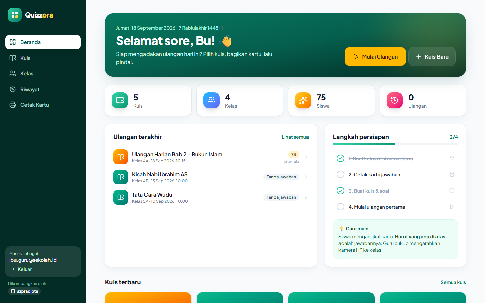
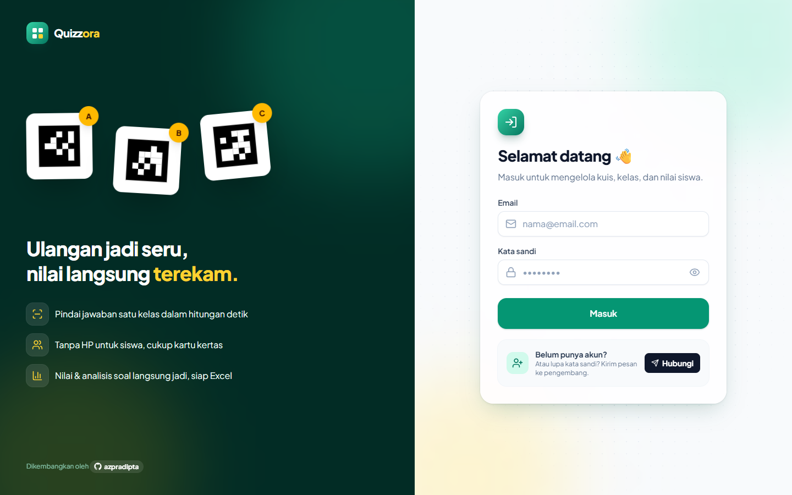
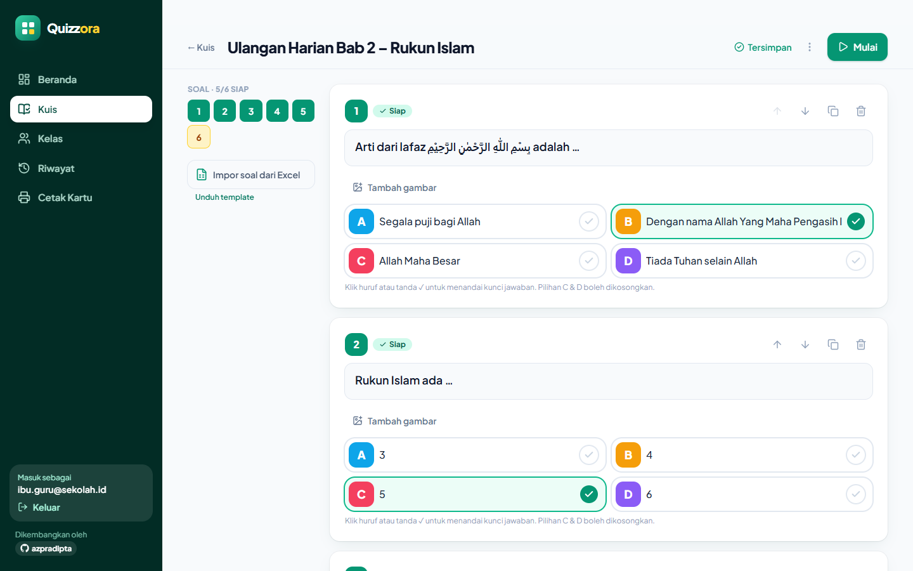
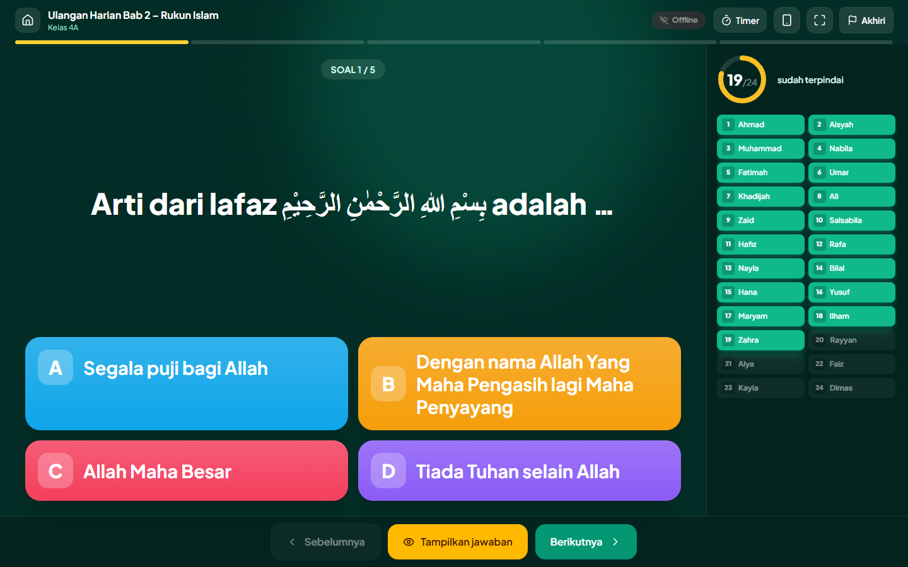
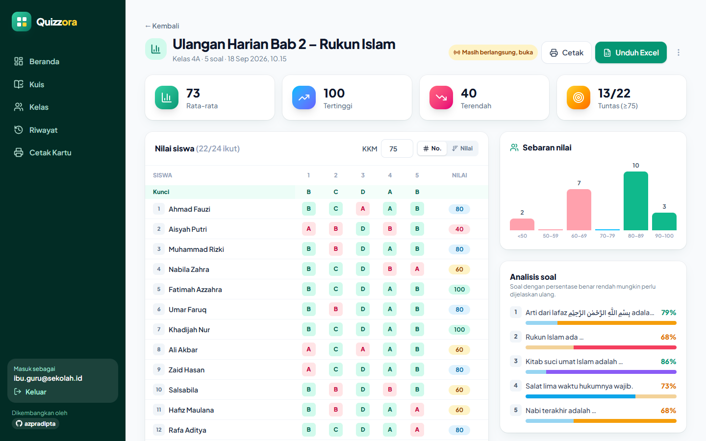
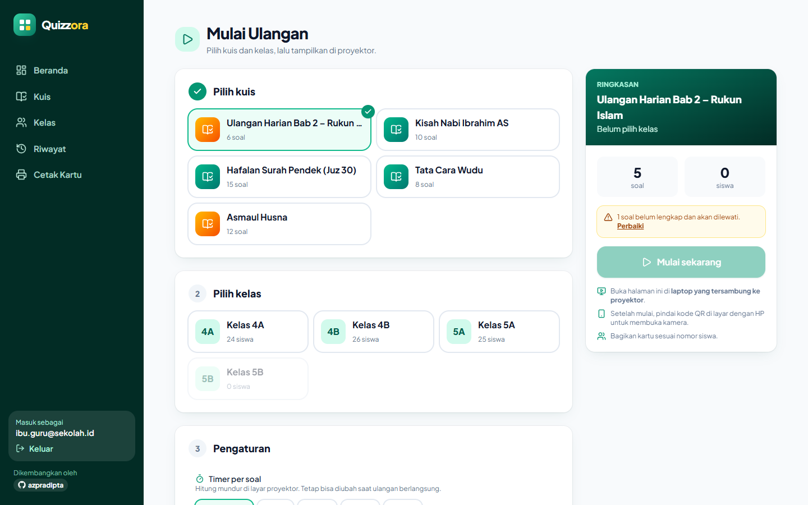
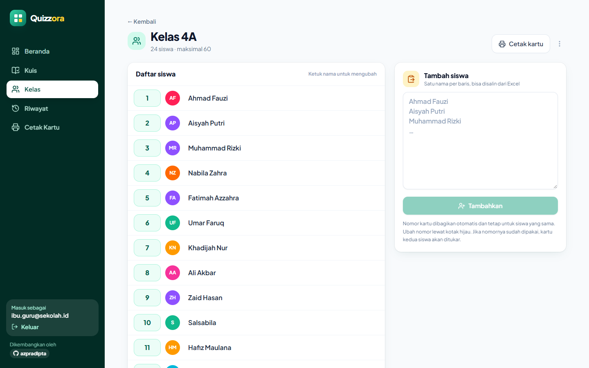
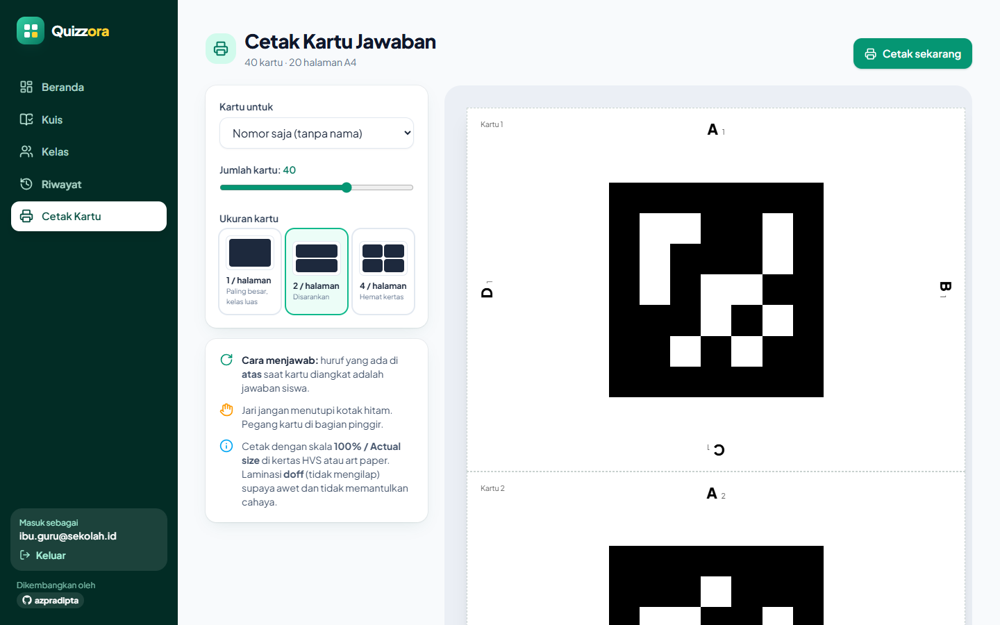

# Quizzora

**Ulangan pilihan ganda dengan kartu jawaban cetak: siswa mengangkat kartu, guru memindai satu kelas dengan kamera HP, nilai langsung terekam.**

Quizzora dibuat untuk guru yang ingin mengadakan ulangan atau kuis interaktif tanpa mengharuskan siswa memegang HP.
Setiap siswa mendapat satu kartu kertas bergambar pola kotak. Huruf **A/B/C/D** di sisi kartu yang menghadap **ke atas**
saat diangkat adalah jawabannya. Guru mengarahkan kamera HP ke kelas, dan puluhan kartu terbaca sekaligus.
Soal tampil di proyektor, jawaban masuk seketika, dan laporan nilai siap diunduh ke Excel.

Aplikasi ini awalnya dibuat untuk guru Pendidikan Agama Islam di sekolah dasar, jadi teks Arab (ayat, doa) didukung penuh.
Aplikasi tetap bisa dipakai untuk mata pelajaran apa pun.



---

## Daftar isi

- [Fitur](#fitur)
- [Tampilan](#tampilan)
- [Cara kerja di kelas](#cara-kerja-di-kelas)
- [Teknologi](#teknologi)
- [Menjalankan secara lokal](#menjalankan-secara-lokal)
- [Deploy ke Vercel](#deploy-ke-vercel)
- [Environment variables](#environment-variables)
- [Struktur proyek](#struktur-proyek)
- [Kartu jawaban & deteksi](#kartu-jawaban--deteksi)
- [Keamanan & data](#keamanan--data)
- [Batasan](#batasan)
- [Kredit](#kredit)

---

## Fitur

### Ulangan dengan kartu (paper mode)
- **Kartu jawaban cetak** 1, 2, atau 4 per halaman A4, bisa dengan nama siswa. Tiap siswa punya nomor kartu tetap.
- **Pemindai kamera di HP** mendeteksi banyak kartu sekaligus, lengkap dengan kotak penanda, nama siswa, getar, dan bunyi saat kartu tercatat.
- **Anti salah baca**: jawaban dicatat setelah terbaca sama di 2 frame. Siswa boleh mengganti jawaban sebelum kunci ditampilkan, dan yang tercatat adalah jawaban terakhir.
- **Zoom dan senter** tersedia di HP yang mendukung, untuk barisan belakang atau kelas yang redup.

### Layar proyektor (realtime)
- **Lobi** dengan kode QR besar untuk membuka pemindai di HP guru.
- **Status siswa**: soal dan pilihan jawaban berwarna, cincin progres "sudah terpindai", dan daftar siswa yang menyala saat kartunya tercatat.
- **Tampilkan jawaban**: kunci disorot, persentase tiap pilihan tampil, dan konfeti muncul kalau mayoritas kelas benar.
- **Timer per soal** (15–90 detik) yang bisa diatur sebelum mulai atau di tengah ulangan.
- **Layar selesai**: rata-rata kelas dan **podium 3 besar** (opsional).
- **Kendali dari dua perangkat**: laptop dan HP bisa sama-sama mengendalikan ulangan dan selalu tersinkron.
- **Pintasan keyboard**: `→`/`←` untuk ganti soal, `Spasi` untuk menampilkan jawaban, `F` untuk layar penuh.

### Bank soal
- **Editor dengan simpan otomatis**, tanpa tombol simpan.
- **Jenis soal**: pilihan ganda 2–4 opsi, template Benar/Salah, dan gambar per soal.
- **Teks Arab** ditampilkan dengan font Amiri dan arah kanan-ke-kiri otomatis.
- **Impor dari Excel** dengan template yang bisa diunduh.
- **Pengelolaan soal**: duplikat soal atau kuis, ubah urutan, dan navigator soal yang menandai soal belum lengkap.

### Kelas & laporan
- **Daftar siswa**: tempel daftar nama sekaligus (bisa dari Excel), dan nomor kartu dibagikan otomatis. Nomor kartu bisa ditukar antarsiswa.
- **Laporan per ulangan**: rata-rata, nilai tertinggi dan terendah, jumlah siswa **tuntas KKM** (KKM bisa diatur), grafik sebaran nilai, tabel jawaban per siswa, dan analisis tiap soal.
- **Ekspor Excel** (lembar nilai dan analisis soal) serta versi siap cetak.
- **Riwayat ulangan** dengan filter per kelas.

### Lain-lain
- **Tampilan responsif**: sidebar di laptop, menu bawah di HP.
- **Login khusus guru** dengan formulir "Hubungi pengembang" untuk minta akun atau reset kata sandi, yang dikirim ke email pengembang.
- **Tanggal Hijriah** di beranda.

---

## Tampilan

| Login | Editor soal |
| --- | --- |
|  |  |

| Layar proyektor | Laporan nilai |
| --- | --- |
|  |  |

| Mulai ulangan | Kelas | Cetak kartu |
| --- | --- | --- |
|  |  |  |

> Screenshot memakai data contoh.

---

## Cara kerja di kelas

```
 Laptop + proyektor                    HP guru
 ┌──────────────────┐   Supabase    ┌──────────────┐
 │ Soal & pilihan    │◄──Realtime──►│ Kamera        │
 │ Siapa sudah jawab │              │ pemindai      │
 │ Kunci & statistik │              │ + tombol      │
 └──────────────────┘               └──────┬───────┘
                                          │ memindai
                          ┌───────────────▼───────────────┐
                          │  Siswa mengangkat kartu:        │
                          │  huruf di ATAS = jawaban        │
                          └────────────────────────────────┘
```

1. **Siapkan kelas.** Buat kelas, lalu tempel nama-nama siswa.
2. **Cetak kartu** untuk kelas tersebut dan bagikan sesuai nomor.
3. **Buat kuis.** Ketik soal atau impor dari Excel.
4. **Mulai ulangan** di laptop yang tersambung ke proyektor: pilih kuis, kelas, dan timer.
5. **Pindai kode QR** di layar dengan HP guru (login dengan akun yang sama) untuk membuka kamera pemindai.
6. **Bacakan soal**, lalu siswa mengangkat kartu. Arahkan HP ke kelas sampai semua nama menyala.
7. Tekan **Tampilkan jawaban**, lalu **Berikutnya**. Di akhir ulangan, tekan **Selesai**, buka laporan, dan unduh Excel.

**Tips:** jarak pindai ideal 2–5 m dengan cahaya cukup. Cetak dengan skala 100% di kertas tebal atau laminasi *doff*
(tidak mengilap). Minta siswa memegang kartu di pinggir supaya kotak hitamnya tidak tertutup jari.

---

## Teknologi

| Bagian | Yang dipakai |
| --- | --- |
| Frontend | [React 19](https://react.dev), [TypeScript](https://www.typescriptlang.org), [Vite](https://vite.dev) |
| Tampilan | [Tailwind CSS v4](https://tailwindcss.com), [Motion](https://motion.dev) (animasi), [Lucide](https://lucide.dev) (ikon), font Plus Jakarta Sans & Amiri |
| Backend | [Supabase](https://supabase.com): Postgres, Auth, Realtime, Storage (gambar soal) |
| Deteksi kartu | [js-aruco2](https://github.com/damianofalcioni/js-aruco2) (dimodifikasi) di **Web Worker**, dengan kamus marker kustom |
| Lainnya | [SheetJS](https://sheetjs.com) (Excel), [qrcode](https://github.com/soldair/node-qrcode), [canvas-confetti](https://github.com/catdad/canvas-confetti), [Web3Forms](https://web3forms.com) (formulir kontak) |
| Hosting | [Vercel](https://vercel.com) |

Aplikasi ini sepenuhnya statis (SPA). Tidak ada server sendiri: data, login, dan sinkronisasi ditangani Supabase.

---

## Menjalankan secara lokal

Kebutuhan: **Node.js 20+** dan proyek Supabase (lihat langkah 1 di bagian deploy).

```bash
git clone https://github.com/azpradipta/quizzora.git
cd quizzora
npm install
cp .env.example .env.local     # lalu isi nilainya
npm run dev                    # http://localhost:5173
```

| Perintah | Kegunaan |
| --- | --- |
| `npm run dev` | Server pengembangan |
| `npm run dev:hp` | Server HTTPS yang bisa dibuka HP di Wi-Fi yang sama, untuk menguji kamera (browser hanya mengizinkan kamera di HTTPS) |
| `npm run build` | Cek tipe + build produksi ke `dist/` |
| `npm run preview` | Menjalankan hasil build secara lokal |

---

## Deploy ke Vercel

Semua layanan di bawah punya paket gratis yang cukup untuk pemakaian satu sekolah.

### 1. Supabase (database, login, realtime)

1. Buat proyek di <https://supabase.com> dengan region **Southeast Asia (Singapore)**.
2. Buka **SQL Editor** → **New query**, tempel seluruh isi [`supabase/schema.sql`](supabase/schema.sql), lalu klik **Run**.
   Skrip ini membuat tabel, aturan keamanan (RLS), publikasi realtime, dan bucket gambar soal.
3. Buka **Authentication → Users → Add user → Create new user** untuk membuat akun guru (centang *Auto Confirm User*).
4. Buka **Authentication → Sign In / Providers**, lalu **matikan** *Allow new users to sign up*. Akun hanya dibuat oleh pengelola.
5. Buka **Project Settings → API** dan salin **Project URL** serta **anon public key**.

> Proyek Supabase gratis akan dijeda otomatis setelah 7 hari tanpa aktivitas. Jika aplikasi tidak bisa login
> setelah libur panjang, buka dashboard Supabase lalu klik **Restore project**.

### 2. Web3Forms (opsional, untuk formulir "Hubungi pengembang")

1. Buka <https://web3forms.com>, masukkan email Anda, lalu klik **Create Access Key**. Key dikirim ke email tersebut.
2. Setiap permintaan akun dari halaman login akan masuk ke email itu. Tekan **Reply** untuk membalas langsung ke pengirim.

Tanpa key ini aplikasi tetap berjalan. Formulir hanya akan menampilkan pesan bahwa fitur belum diaktifkan.

### 3. Vercel

1. Push repositori ke GitHub.
2. Di <https://vercel.com>, pilih **Add New → Project**, lalu impor repositori ini. Framework **Vite** terdeteksi otomatis
   (build command `npm run build`, output `dist`).
3. Isi **Environment Variables** (lihat tabel di bawah), lalu klik **Deploy**.
4. Buka alamat `https://<nama-proyek>.vercel.app` di laptop dan HP, lalu login.

Routing SPA sudah diatur di [`vercel.json`](vercel.json), jadi halaman seperti `/sesi/...` tidak 404 saat di-refresh.
Setelah mengubah environment variable, lakukan **Redeploy** agar nilainya terpakai.

---

## Environment variables

| Nama | Wajib | Keterangan |
| --- | --- | --- |
| `VITE_SUPABASE_URL` | ✅ | Project URL Supabase, mis. `https://abcd.supabase.co` |
| `VITE_SUPABASE_ANON_KEY` | ✅ | *anon public key* atau *publishable key* Supabase |
| `VITE_WEB3FORMS_KEY` | – | Access key Web3Forms untuk formulir kontak di halaman login |

Ketiganya memang dirancang untuk dipakai di browser dan aman diletakkan di frontend. **Jangan** pernah memasukkan
*service_role key* atau *secret key* Supabase ke aplikasi ini.

---

## Struktur proyek

```
quizzora/
├── supabase/schema.sql         # Skema database + RLS + realtime + storage
├── vercel.json                 # Rewrite SPA untuk Vercel
├── docs/screenshots/           # Gambar untuk README
├── scripts/                    # Alat bantu kamus marker & pengujian deteksi
└── src/
    ├── pages/                  # Halaman: Dashboard, Quizzes, QuizEditor, Classes, ClassEditor,
    │                           #   PrintCards, StartSession, Presenter, Scanner, Report, History, Login
    ├── components/             # Layout, komponen UI, dialog/toast, tampilan soal, formulir kontak
    ├── lib/
    │   ├── supabase.ts         # Klien Supabase (+ retry otomatis untuk selisih jam token)
    │   ├── useLiveSession.ts   # Sinkronisasi realtime proyektor ↔ HP
    │   ├── stats.ts            # Perhitungan nilai & analisis soal
    │   ├── excel.ts            # Impor soal & ekspor laporan
    │   ├── timer.ts            # Pengaturan timer per soal
    │   └── contact.ts          # Pengiriman formulir via Web3Forms
    └── scan/
        ├── markers.ts          # Kamus marker, nomor kartu, arah jawaban
        ├── worker.ts           # Deteksi di Web Worker
        ├── useCardScanner.ts   # Kamera, zoom, senter
        └── aruco-vendor.js     # js-aruco2 (BSD) sebagai modul ES
```

### Model data

| Tabel | Isi |
| --- | --- |
| `classes`, `students` | Kelas dan siswa beserta nomor kartunya |
| `quizzes`, `questions` | Kuis dan soal (teks, gambar, pilihan, kunci) |
| `sessions` | Satu ulangan: **salinan** soal & daftar siswa, soal aktif, status tampil jawaban |
| `responses` | Jawaban per siswa per soal (satu baris per kartu per soal) |

Sesi menyimpan salinan soal dan siswa, jadi laporan lama tidak berubah walaupun kuis atau kelas diedit kemudian.

---

## Kartu jawaban & deteksi

- Kartu memakai **marker persegi 5×5** dari kamus buatan sendiri ([`scripts/gen-dictionary.mjs`](scripts/gen-dictionary.mjs)):
  60 kode dengan **jarak Hamming minimal 8**, termasuk terhadap versi rotasinya. Hasilnya, nomor kartu dan arah jawaban tetap
  terbaca benar walaupun beberapa kotak kecil salah terbaca.
- Arah jawaban ditentukan dari orientasi marker. Di kartu cetak, **A di atas, B di kanan, C di bawah, D di kiri**, dan setiap huruf
  dicetak tegak saat sisinya menghadap ke atas.
- Deteksi berjalan di **Web Worker** pada resolusi penuh dan setengah (multi-skala), sehingga kartu kecil dan gambar yang agak buram
  tetap terbaca tanpa membuat tampilan kamera tersendat.

Pengujian:

```bash
node scripts/test-markers.mjs   # uji arah A/B/C/D pada gambar sintetis
npm run dev                     # lalu buka:
#   /scripts/scan-test.html?size=40&blur=1&tilt=15   → 30 kartu dalam satu frame 1080p
#   /scripts/cards-test.html?per=2                   → pratinjau tata letak kartu cetak
```

---

## Keamanan & data

- **Login email & kata sandi** lewat Supabase Auth. Pendaftaran mandiri dimatikan, jadi akun dibuat oleh pengelola.
- **Row Level Security** aktif di semua tabel. Setiap guru hanya bisa membaca dan mengubah datanya sendiri.
- **Gambar soal** disimpan di bucket `question-images` dalam folder milik masing-masing akun.
- **Pengaturan KKM dan timer** tersimpan di browser (localStorage), bukan di database.
- Siswa tidak memakai perangkat dan tidak memasukkan data apa pun. Yang disimpan hanya nama siswa yang diisi guru.

---

## Batasan

- Maksimal **60 siswa per kelas** (60 kode kartu). Kartu bernomor sama boleh dipakai di kelas yang berbeda.
- Hanya soal **pilihan ganda** (2–4 pilihan).
- Pemindai butuh **HTTPS** dan browser modern (Chrome Android / Safari iOS terbaru).
- Pemindai dan proyektor butuh koneksi internet untuk sinkronisasi.

---

## Kredit

- Dikembangkan oleh **[azpradipta](https://github.com/azpradipta)**.
- Deteksi marker berbasis [js-aruco2](https://github.com/damianofalcioni/js-aruco2) oleh Damiano Falcioni (lisensi BSD),
  turunan dari [js-aruco](https://github.com/jcmellado/js-aruco) dan [ArUco](https://www.uco.es/investiga/grupos/ava/portfolio/aruco/).
- Konsep "paper mode" terinspirasi dari metode kartu jawaban yang dipindai kamera seperti Plickers dan Quizizz Paper Mode.
  Quizzora tidak berafiliasi dengan layanan tersebut, dan desain kartu serta kodenya dibuat sendiri.
